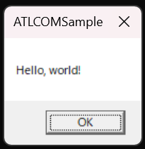
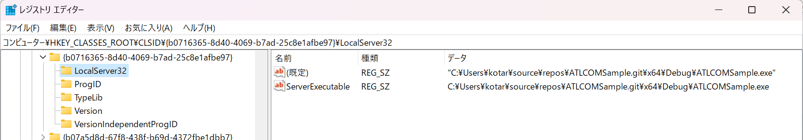
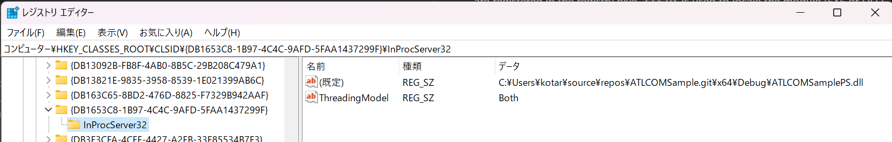
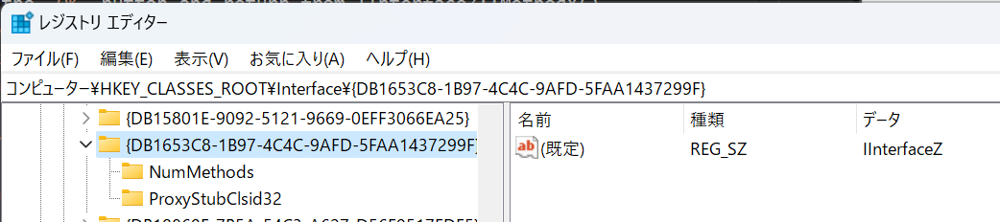

# ATLCOMSample

 A simple sample to demonstrate how to create a COM local server (out-of-proc COM server running on local PC).

# Folder structure
- `ATLCOMSample` : Project to implement the COM server.
- `ATLCOMSamplePS` : Project to build the Proxy/Stub for the COM class.
- `client` : Project to build a command-line program to demonstrate calling in the COM class.


# How to build
Basically, just build the entire solution, including the three projects, and it should do it. However, you'll hit a post-build error [MSB8011](https://learn.microsoft.com/en-us/visualstudio/msbuild/errors/msb8011?view=vs-2022) saying that registration fails. This is because at the post-build stage the solution tries to register the Proxy/Stub, but the registration happens per-machine level while you don't have such permission.
To work this around, do either of the following:
- Run Visual Studio elevated.  
or
- Ignore the post-build error. But after building open an elevated command prompt and there run following command:
```
        regsvr32 ATLCOMSamplePS.dll
```

# Notes
- The project file for ATLCOMSamplePS that is automatically generated by the tool seems to have a problem that it cannot find artifacts generated by building ATLCOMSample project. I manually edited the project file (ATLCOMSamplePS.vcxproj) to address this. Check commit [823b1e5](https://github.com/kotaroy-BD/ATLCOMSample/commit/823b1e5a788887d8da01d0d95cca76568585bae0).
- Use of raw pointer is highly discouraged but I'm still using it (for `pIInterfaceZ`) to keep the sample code bare minimum. Ideally, we should use some form of smart pointer implementation.

# How to play
After build and registration, run client.exe (either on debugger or just kick it from command-prompt). If it successfully works, a message box dialog shows up.  


This message box is implemented in the COM class hosted in `ATLCOMSample.exe`, not in `client.exe`. By checking task manager, you'll see that `ATLCOMSample.exe` is running. You also notice:
- This is a blocking call, meaning that until you hit the `OK` button and return from IInterfaceZ::MethodY() in `ATLCOMSample.exe` side, the caller thread in `client.exe` is blocked.
- Process lifetime of the COM server (`ATLCOMSample.exe`) is managed by COM. As soon as you execute `client.exe`, `ATLCOMSample.exe` is automatically launched, and once `client.exe` ends (to be more accurate, as soon as you call `pIInterfaceZ->Release()`), `ATLCOMSample.exe` is terminated.
- If you take a closer look of the processes using [ProcessExplorer](https://learn.microsoft.com/en-us/sysinternals/downloads/process-explorer), you'll find that `ATLCOMSample.exe` is ***not*** child process of `client.exe`. `ATLCOMSample.exe` is spawned by COM runtime.

# How COM registration works
In a nutshell, COM needs two things registered to the system. `class` and `interface`. All classes and interfaces have different unique IDs, which is GUID, called `CLSID` (class ID) and `IID` (interface ID) respectively. Both `CLSIDs` and `IIDs` are registered in the registry hive. `CLSID` is used to locale the module (EXE or DLL) that implements the corresponding COM class. `IID` is used to give information to COM runtime about the interface and to locate the module (DLL) that implements proxy/stub for the interface. Proxy/stub are necessary when making a cross-apartment call (including cross-process call). By using Proxy/stub, COM packages and unpackages method parameters and returned data to transmit across the apartment boundary, called marshalling.  

In registry you can find the following three blocks:
- Registration for `CLSID` of the main COM object (`ATLCOMSample`), which locates `ATLCOMSample.exe`
- Registration for `IID` of `IInterfaceZ`,
- Registration for `CLSID` of the proxy/stub object, which shares the same ID as its `IID`, which locates `ATLCOMSamplePS.exe`





When client of COM server (example in `client.exe`), it calls `CoCreateInstance` API, passing COM class's CLSID and an IID that identifies one of interfaces known that it's implemented in the COM class. COM runtime looks into the registry to find the CLSID to localte the module path (EXE or DLL) that implements the COM class, loads the module (in to the caller's process space if the COM class is implemented in DLL, or launch a new process if the COM class is implemented in EXE), get an interface pointer of specificied interface by IID, and return that interface pointer as the result of API call. Marshalling will happen under the hood in this proces which uses proxy/stub module if necessary.

Once client gets the interface pointer, from programmer's perspective it's just a matter of making normal method call against the interface (`pIInterfaceZ->MethodY();`). COM does everything under the hood to make this call reach to server side (even if it resides in another process) and return the result from the COM class as if it's just a normal method call happening on the caller's thread.

# Per-machine registration vs. per-user registration
In this example, CLSID and IID are registered in per-machine manner. You can tell that by looking registry key paths - They're registered under `HKCR\CLSID\{GUID}` and `HKCR\Interface\{GUID}` (here, `HKCR` is a short name for `HKEY_CLASSES_ROOT`). 

On the other hand, there're corresponding per-user registry hives for CLSID and IID, that are `HKCU\Software\Classes\CLSID\{GUID}` and `HKCU\Software\Classes\Interface\{GUID}` respectively (here, `HKCU` is a short name for `HKEY_CURRENT_USER`).

Registering to HKCR requires admin privilege while registering to HKCU does not.


# Self-reg
In real product, it is a common practice to have setup program (e.g. using Windows Installer) write these COM registration registry (and clean it up on uninstallation). However, mainly for internal development ease, there's also a common practice known as `Self-reg`. This is a practice that you implement in your COM server module (regardless it's DLL or EXE) so that these modules write the registry by themselves.

For DLL, your DLL should implement `DllRegisterServer` and `DllUnregisterServer` export functions and do registration/unregistration inside the export functions. Then you (or users) can register your module by running:  
```
RegSvr32.exe your-module.dll (to register)
RegSvr32.exe /u your-module.dll (to unregister)
```

For EXE, your EXE should implement so that it responds to `/RegServer` and `/UnregServer` command-line parameter and do the work. Then you (or users) can register your module by running:

```
your-module.exe /RegServer (to register)
your-module.exe /UnregServer (to unregister)
```
In this example, these functions are automatically implemented by library (ATL) so you don't really have to craft by yourself. But a downside is that it's hard to tweak because it's hidden underneath the library implementation. ATL's self-reg implementation always does per-machine registration so you can hardly do per-user registration using the self-reg.


# How to add a new method, interface, class
- To add a method to an existing interface, just add the method to the interface definition in `.idl` file and implement the method in the class definition that implements (inherits) the interface (in either `.h` or `.cpp`). You should change `IID` (assign new `GUID`) to the interface because adding a method changes interface signature so now it's a "different" interface from what it used to be.
- To add an interface to an existing class, create the interface definition in the `.idl` file, add the interface to base class of the implementing class, and implement the methods of the interface in the class. You don't need to (and should not) change `CLSID` of the class. Don't forget to register the new interface you just created.
- To add a class create a class definition in the `.idl` file with new `CLSID`. Then create a C++ class to implement it. If you're using ATL, you can inherit base classes provided by ATL (`CComObjectRootEx` and `CComCoClass`) to get common basic implementation to fulfill COM requirements for free.

See commit [7aa6557](https://github.com/kotaroy-BD/ATLCOMSample/commit/7aa65572f568b64e62aed7942367a195c85292b0) that demonstrates adding methods in a new interface and implementing the methods in a new class.


# Author
- kotaro.yoshida@boostdraft.com
